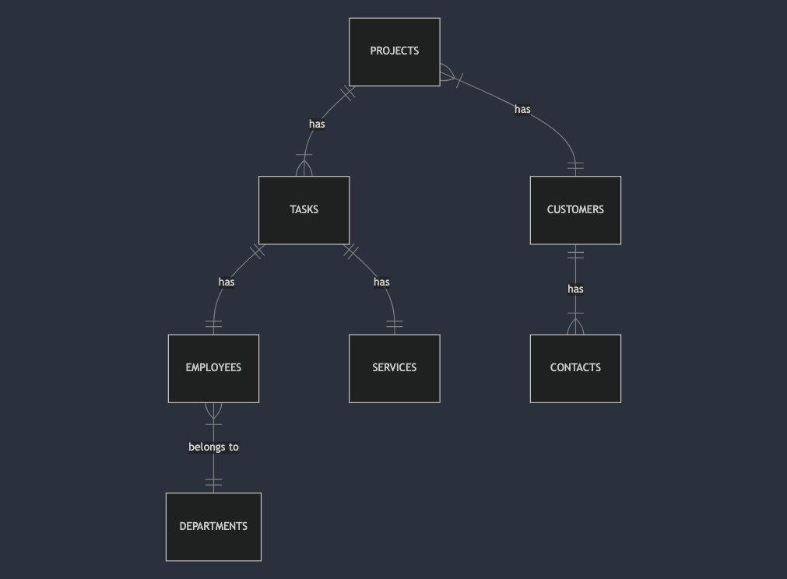

# Design Document

By Américo Cot Toloza

Video overview: https://youtu.be/hgoJP_OhZRM

## Scope

The database for CS50 SQL implemented with MySQL includes all entities necessary to facilitate the process of tracking projects and tasks progress, schedule tasks, calculate spended time in a project, services prices, budget balance, assignment of employees to tasks, list tasks assigned to an employee, list projects tasks, list clients projects and track clients and contacts with their related projects. The database implement `soft deletion` projects and tasks.
As such, included in the database's scope is:

* Projects, including information about project status, description, asociated tasks, client and a dedicated budget.
* Tasks, including schedule information and dedicated time, the service associated with the task, task status and employee assigned to the task.
* Services, defines the diferents services and prices.
* Employees, including basic identifying information, rate hour price, to calculate retributions and costs.
* Departments, include the name of the department by organizational topics.
* Clients, including identifying information like company name, address, phone and type of company.
* Contacts, including basic contact information like phone, email and company.

Out of scope are elements like calculate earns, compiling invoices, calculate taxes and more advanced financial calculs.

## Functional Requirements

This database will support:

* A user with administrator privileges should be able to create a project, assign a client, a set of scheduled tasks, assign an employee to each task, and view the budget used for that project.

* A user without administrator privileges should be able to view the tasks assigned to them and update the time spent on an assigned task.

* Note that in this iteration, the system will not support employees leaving comments on tasks.

## Representation

Entities are captured in MySQL tables with the following schema.

### Entities

The database includes the following entities:

#### Projects

The `projects` table includes:

* `id` which specifies the unique ID for the student as an `INT UNSIGNED AUTO_INCREMENT`. This column thus has the `PRIMARY KEY` constraint applied.
* `name` which specifies the project name as `VARCHAR(64)` with constraints `NOT NULL UNIQUE` to avoid duplicates names and invalids unnamed projects.
* `description` which specifies a project summary as `TEXT`. No constraints applied.
* `date_created` which specifies project creation date as `DATETIME`. Constraint `DEFAULT CURRENT_TIMESTAMP` required to set the current time on record creation.
* `deadline` which specifies project completion date `DATETIME`. Constraint `NOT NULL` required to calculate days left to complete.
* `budget` which defines the initial budget for the project formated `DECIMAL(7,2)`. We don't work for free :) `NOT NULL`. Verify the budget is not negative or zero `CHECK(`budget` > 0)`.
* `client_id` defines de ID of the client requesting the job as an `INT`. This column thus has the `FOREIGN KEY` constraint applied, referencing the `id` column in the `clients` table to ensure data integrity.
* `contact_id` Defines the ID of the contact that requested the job as an `INT`. This column thus has the `FOREIGN KEY` constraint applied, referencing the `id` column in the `contacts` table to ensure data integrity.
* `is_active` defines a boolean flag to represent the status of the project as a `BOOLEAN` with default value set to true `DEFAULT 1`.
* `is_deleted` defines a boolean flag to implement soft deletion as a `BOOLEAN` with default value set to not deleted `DEFAULT 0`.

#### Tasks

The `tasks` table includes:

* `id` which specifies the unique ID for a task as an `INT UNSIGNED AUTO_INCREMENT`. This column thus has the `PRIMARY KEY` constraint applied.
* `project_id` defines de ID of the related project as an `INT` . This column thus has the `FOREIGN KEY` constraint applied, referencing the `id` column in the `projects` table to ensure data integrity.
* `employee_id` defines the ID of the employee assigned to the project as `INT`. This column thus has the `FOREIGN KEY` constraint applied, referencing the `id` column in the `employees` table to ensure data integrity.
* `type` defines the type of the task `ENUM('audio', 'video', 'vfx', '3d', 'design', 'revision') NOT NULL`. It will allow us to make lists depending on the type of task.
* `comment` which specifies a comment containing information about the task as `TEXT`.
* `start_time` specifies the timestamp at which the task should start as `TIMESTAMP NOT NULL`.
* `end_time` specifies the timestamp at which the task should end as `TIMESTAMP NOT NULL`.
* `spended_time` a numeric representation of the dedicated time to a specific task as `DECIMAL(6,2) AS (TIMESTAMPDIFF(HOUR, start_time, end_time))`.
    It allows us to calculate the time spent on a project by adding up all the time spent on its tasks and the cost of the project.
* `is_deleted` defines a boolean flag to implement soft deletion as a `BOOLEAN` with default value set to not deleted `DEFAULT 0`.

#### Services

* `name` specifies the name of the service as `VARCHAR(64) UNIQUE NOT NULL`. This column thus has the `PRIMARY KEY` constraint applied.
* `price` specifies the price of the service as `DECIMAL(5,2) NOT NULL DEFAULT 0`.

#### Clients

The `clients` table includes:

* `id` which specifies the unique ID for a client as an `INT UNSIGNED AUTO_INCREMENT`. This column thus has the `PRIMARY KEY` constraint applied.
* `name` which specifies the client name as `VARCHAR(64) NOT NULL UNIQUE`.
* `phone` which specifies the client phone number as `VARCHAR(64) NOT NULL UNIQUE`. Choosed `VARCHAR` because some phones number description includes special characters.
* `address` which specifies the client address as `VARCHAR(64) NOT NULL UNIQUE`.
* `company_type` which specifies the type of the company as `ENUM('production', 'agency', 'platform', 'publisher','other') DEFAULT 'other'`. Default value used also for clients that are not companys, Ex: a person. It will allow you to list or classify companies by type.

#### Contacts

The `contacts` table includes:

* `id` which specifies the unique ID for a contact as an `INT UNSIGNED AUTO_INCREMENT`. This column thus has the `PRIMARY KEY` constraint applied.
* `first_name` which specifies the contact's first name as `VARCHAR(64) NOT NULL`. At least we need a name.
* `last_name` which specifies the contact's last name as `VARCHAR(64) DEFAULT ' '`.
* `full_name` which calculates the contact's full name using `CONCAT` function as `VARCHAR(128) AS (CONCAT('first_name', ' ', 'last_name'))`. This field is `VIRUAL GENERATED`.
* `phone` which specifies the contact's telephone number as  `VARCHAR(64) NOT NULL UNIQUE`. Choosed `VARCHAR` because some phones number description includes special characters.
* `email` which specifies the contact's email as `VARCHAR(48) NOT NULL UNIQUE`.
* `client_id` defines de ID of the related client in this contact as an `INT`. Represents the client where this contact works for.

#### Employees

The `employees` table includes:

* `id` which specifies the unique ID for a contact as an `INT UNSIGNED AUTO_INCREMENT`. This column thus has the `PRIMARY KEY` constraint applied.
* `first_name` which specifies the contact's first name as `VARCHAR(64) NOT NULL`. At least we need a name.
* `last_name` which specifies the contact's last name as `VARCHAR(64) DEFAULT ' '`.
* `full_name` which calculates the contact's full name using `CONCAT` function as `VARCHAR(64) AS (CONCAT('first_name', ' ', 'last_name'))`. This field is `VIRUAL GENERATED`.
* `gender` specifies the gender of an employee as `ENUM ('M','F', 'O')  NOT NULL`.
* `hire_date` which specifies when the employee started working for the company as `DATE NOT NULL`.
* `rate_hour` specifies the salary or cost per hour of the employee as `DECIMAL(5,2) NOT NULL CHECK(`rate_hour` > 0)`. We check the rate can`t be zero or less.
It will allow us to calculate or track the project budget consumption.
* `is_deleted` defines a boolean flag to implement soft deletion as a `BOOLEAN` with default value set to not deleted `DEFAULT 0`.

#### Departments

* `id` which specifies the unique ID for a department as an `INT UNSIGNED AUTO_INCREMENT`. This column thus has the `PRIMARY KEY` constraint applied.
* `name` which specifies the department name as `VARCHAR(100)` with constraints `NOT NULL UNIQUE` to avoid duplicates names.

### Relationships

As detailed by the diagram:

* One project has one to many tasks realtionship. It is assumed that projects will have at least one task and may have several ones.
* One task has one service associated and one employee assigned.
* One customer has one to many projects relationship. A project has been commissioned by one customer and a customer may have commissioned multiple projects.
* One customer has one to many contacts relationship. A contact has one customer associated and a customer may have multiple contacts.
* One department has one to many employee relationship. A department may have several employees and an employee belongs to one department.

## Optimizations

### Indexes

* The `name` column in the `projects` table is implicitly indexed by MYSQL because it has the `UNIQUE` constraint, which acts like a regular index with additional uniqueness checking.

* `company_type_index` : It is common for users to list companies by type. Ex: 'Production' or 'Editorial'.
* `is_deleted_project_index` : When users search for `projects` they are actually looking for non soft deleted projects with a `WHERE`clause. This index speed up the filtering process.
* `is_deleted_task_index` : The same case as for `projects`.

 The last two indexes are crucial when executing common table expressions and stored procedures.

### Common Table Expressions

* One common query is to calculate budget balance for a project `(budget - all services * hours consumed or scheduled)`, so I've created a CTE called `project_budget_services_consumed` to use agreggate value `services_consumed` on the same query.

* Another common query is list all active projects budget balance based on budget and scheduled tasks for a specific month, so I've created a CTE called `projects_monthly_balance` to use agreggate value `services_consumed` on the same query.

* The next CTE calculates the total incomes expected by service on a specific month and is called `services_incomes_by_month`.

### Stored Procedures

* A common need is to know how much of a project's budget has been consumed, so I create `get_project_services_consumed_id` and `get_project_services_consumed_by_name` stored procedures that get the project balance by either project id or project name.

### Triggers

* When a project is soft deleted, all related tasks need to be updated accordingly, so I created a trigger called `delete_tasks` to update the tasks according to the value updated in the project's `is_deleted` column.

Similarly, it is also common practice for a user of the database to concerned with viewing all students who submitted work to a particular problem. As such, an index is created on the `name` column in the `problems` table to speed the identification of problems by name.

## Limitations

In this iteration, the user is not able to represent invoices or calculate profits based on costs and revenues (budgets).
A `budget` table and an `invoices` table with `services` related to `projects` are required to represent `invoices`.
The `departments` and `employees` tables could be more extensive, representing useful information about staff and relationships between them,
such as roles.

